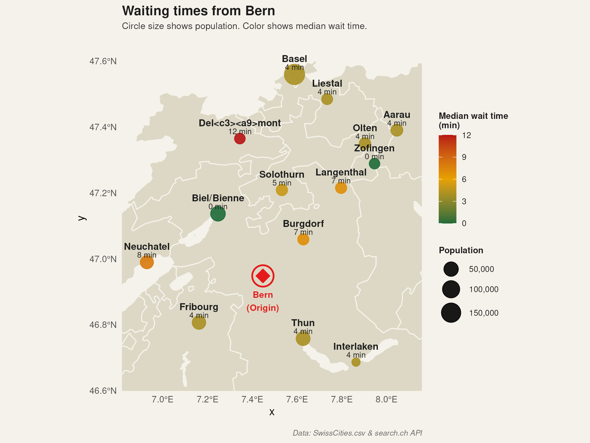

# swiss.public.transport

An R package to download, analyze and visualize public transport accessibility in Switzerland, using the [search.ch timetable API](https://search.ch/timetable/api/help).

Starting from a regional origin station, the package queries connections to the destination stations of the same region and computes a waiting-time accessibility indicator: how long a traveller has to wait, at selected query times, for the next available departure to each destination.

## Example Figure



## Installation

You can install `swiss.public.transport` directly from the source tarball (`.tar.gz`). Because this package includes spatial mapping features, it requires a few external system libraries to be installed on your computer first.

### Install System Prerequisites

Before opening R, open your system terminal (not the R console) and run the command for your operating system:

* **Ubuntu / Debian Linux:**
  ```bash
  sudo apt-get update
  sudo apt-get install libudunits2-dev libgdal-dev libgeos-dev libproj-dev
  ```
* **macOS (using Homebrew):**
  ```bash
  brew install udunits gdal geos proj
  ```
* **Windows:** You can skip this step, but ensure you have [Rtools](https://cran.r-project.org/bin/windows/Rtools/) installed to compile source packages.

### Install Required Packages

Once the system prerequisites are met, open R or RStudio.

```R
install.packages("sf")
install.packages("path/to/swiss.public.transport.tar.gz", repos = NULL, type = "source")
```

## Workflow

```r
library(swiss.public.transport)

cache_dir <- file.path(tempdir(), "swiss_transport_cache")

# 1. Read the regional station data
station_data <- read_station_data(target_group = 2)

# 2. Build the tidy origin-destination-date-time query table
query_table <- build_route_query_table(
  station_data,
  query_date  = "2026-06-20",
  query_times = c("07:00", "09:00", "12:00", "16:00", "18:00")
)

# 3. Download and cache all route connections
populate_route_cache(query_table, cache_dir = cache_dir)

# 4. Parse the responses and compute the waiting-time indicators
parsed   <- combine_parsed_queries(query_table, cache_dir = cache_dir)
waiting  <- summarise_waiting(parsed)

# 5. Plot the waiting-time accessibility map
plot_accessibility_map(waiting, station_data)
```

A full runnable example is available at:

```r
source(system.file("examples", "example.R", package = "swiss.public.transport"))
```

## Main functions

| Function | Purpose |
|----------|---------|
| `read_station_data()` | Read and filter `SwissCities.csv` by group |
| `build_route_query_table()` | Build the tidy query table |
| `get_cached_route()` / `populate_route_cache()` | Call the API with local `.rds` caching |
| `combine_parsed_queries()` | Parse all responses into one tidy table |
| `compute_waiting_time()` / `summarise_waiting()` | Waiting-time indicators per destination |
| `plot_accessibility_map()` | Mandatory waiting-time map |

### Optional route mapping

| Function | Purpose |
|----------|---------|
| `parse_route_legs()` / `combine_parsed_legs()` | Tidy table of route legs (mode, line, stops) |
| `parse_route_points()` / `combine_parsed_points()` | Ordered stop sequence of each leg |
| `plot_route_map()` | Simplified route map drawn through the real stops |

## Notes

- Caching is mandatory: the first run calls the API, later runs read the local `.rds` files. Keep to a single weekday and at most 5 query times.
- The base map is read from the shapefile in `inst/extdata/` and reprojected to longitude/latitude (EPSG:4326).
- Tested with `testthat` (`devtools::test()`); the package passes `devtools::check()`.
